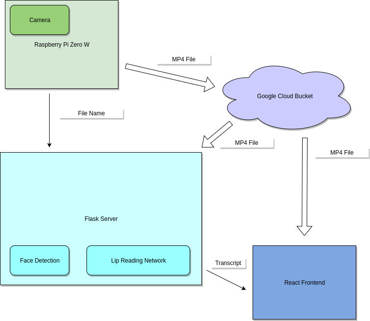
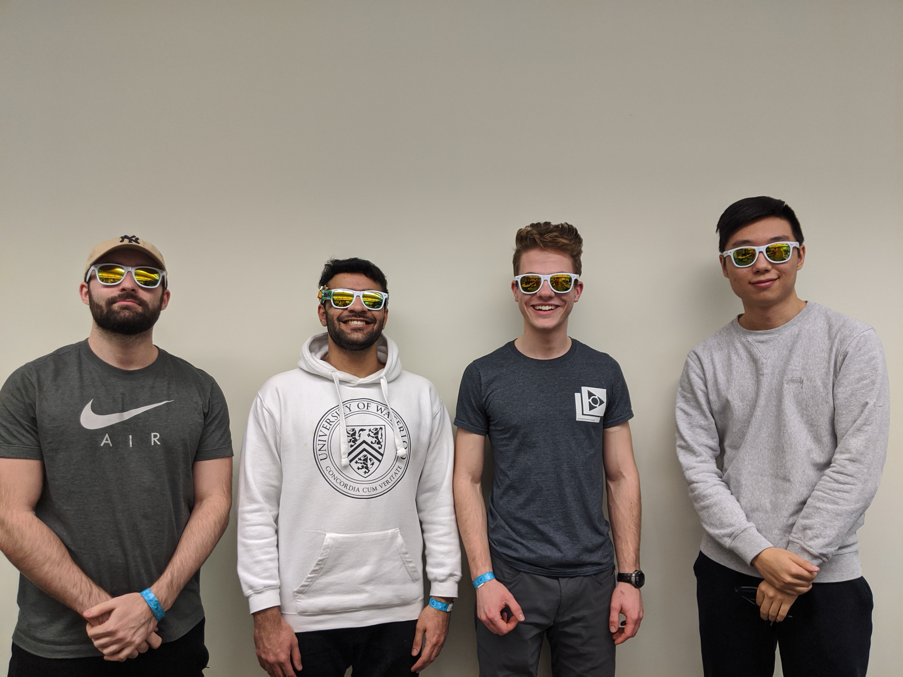

# Synviz

[Devpost submission](https://devpost.com/software/synviz)

Synviz is an IoT device that uses state of the art artificial intelligence to decode text from the movement of a speaker's mouth.

## Inspiration
There were two primary sources of inspiration. The first one was a paper published by University of Oxford researchers, who proposed a state of the art deep learning pipeline to extract spoken language from video. The paper can be found [here](http://www.robots.ox.ac.uk/~vgg/publications/2018/Afouras18b/afouras18b.pdf). The repo for the model used as a base template can be found [here](https://github.com/afourast/deep_lip_reading).

The second source of inspiration is an existing product on the market, [Focals by North](https://www.bynorth.com/). Focals are smart glasses that aim to put the important parts of your life right in front of you through a projected heads up display. We thought it would be a great idea to build onto a platform like this through adding a camera and using artificial intelligence to gain valuable insights about what you see, which in our case, is deciphering speech from visual input.

## Pipeline Overview

* The user presses the button on the glasses to start a recording
* The user clicks the button again to stop recording
* The data is passed to a Google Cloud Platform bucket as an mp4 file
* Simultaneously, the glasses ping the Flask backend server to let it know there's something to be processed
* The backend downloads the video file
* The backend runs the video through a Haar Cascade classifier to detect a face
* The video is cropped so that it tracks the mouth of the speaker
* The cropped video is fed through a transformer network to get a transcript
* The backend passes the transcript and file URL to the frontend through a socket
* The frontend displays the transcript it got from the backend, and also allows playback of the
mp4 file found on Google Cloud Platform

## Use Cases
* For individuals who are hard-of hearing or deaf
* Noisy environments where automatic speech recognition is difficult
* Combined with speech recognition for ultra-accurate, real-time transcripts
* Language learners who want a transcript or translation

## Social Impact
This hack can help in situations where communication is difficult. One of the most promising use cases is when
this technology is combined with automatic speech recognition. All-in-one solutions for real-time transcription and translation
are becoming more viable as our technology progresses.
This proof-of-concept is another key piece that would
improve human computer interaction.

## Next Steps
With stronger on-board battery, 5G network connection, and a computationally stronger compute server, we believe it will be possible to achieve near real-time transcription from a video feed that can be implemented on an existing platform like North's Focals to deliver a promising business appeal.

## The Team

* [Waleed Ahmed](https://github.com/w29ahmed) - Backend (Flask) & Cloud (GCP)
* [Sinclair Hudson](https://github.com/SinclairHudson) - Hardware (Raspberry Pi) & Computer Vision (OpenCV)
* [Martin Ethier](https://github.com/MartinEthier) - Deep Learning (TensorFlow)
* [William Lu](https://github.com/WillyumLu) - Frontend (React)